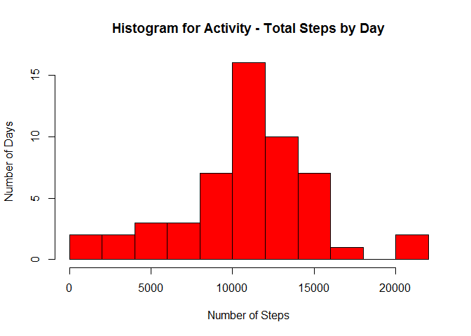
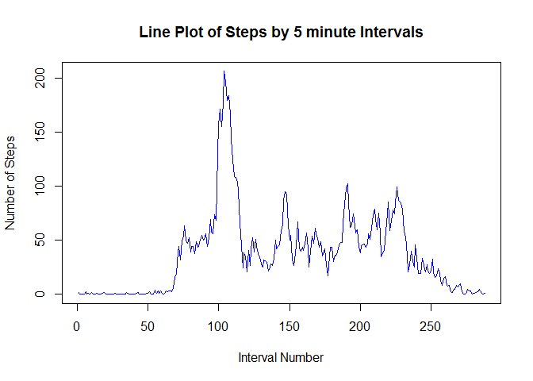
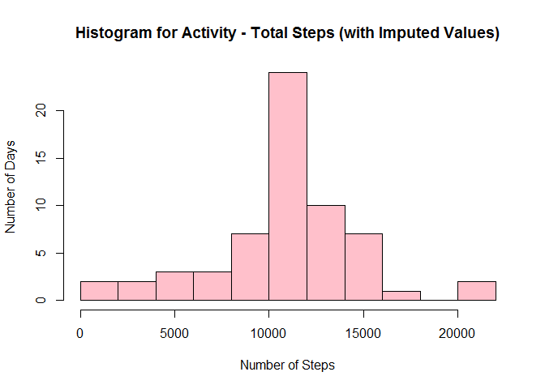
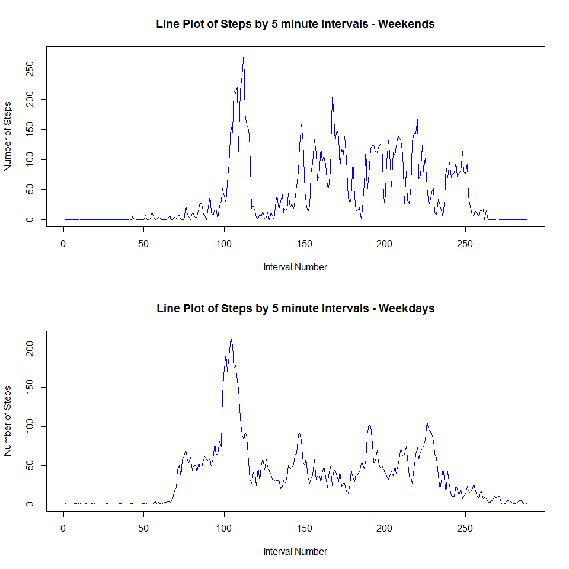

# Reproducible Research: Peer Assessment 1
Richard Seeton  
September 20, 2015  


## Loading and preprocessing the data
#### Load the data, checks that the activity.csv file is present.


```r
if (file.exists("activity.csv"))
{ 
	activity_data <- read.csv("activity.csv")
} else 
{
    return(message("Activity data files (activity.csv)"))
}
```

#### Quick review of the data

```r
summary(activity_data)
```

```
##      steps                date          interval     
##  Min.   :  0.00   2012-10-01:  288   Min.   :   0.0  
##  1st Qu.:  0.00   2012-10-02:  288   1st Qu.: 588.8  
##  Median :  0.00   2012-10-03:  288   Median :1177.5  
##  Mean   : 37.38   2012-10-04:  288   Mean   :1177.5  
##  3rd Qu.: 12.00   2012-10-05:  288   3rd Qu.:1766.2  
##  Max.   :806.00   2012-10-06:  288   Max.   :2355.0  
##  NA's   :2304     (Other)   :15840
```

```r
str(activity_data)
```

```
## 'data.frame':	17568 obs. of  3 variables:
##  $ steps   : int  NA NA NA NA NA NA NA NA NA NA ...
##  $ date    : Factor w/ 61 levels "2012-10-01","2012-10-02",..: 1 1 1 1 1 1 1 1 1 1 ...
##  $ interval: int  0 5 10 15 20 25 30 35 40 45 ...
```

#### Aggregate and Plot total steps by day

```r
activity_steps_totals <- aggregate(steps ~ date, data=activity_data, FUN = function(x) c(totals=sum(x))) 
hist(activity_steps_totals$steps, main="Histogram for Activity - Total Steps by Day", xlab="Number of Steps", ylab="Number of Days", breaks="freedman-diaconis", col="red")
```

 

## What is mean total number of steps taken per day?

####Mean number of Steps per Day: 

```r
mean(activity_steps_totals$steps)
```

```
## [1] 10766.19
```

###Median number of Steps per Day: 

```r
median(activity_steps_totals$steps)
```

```
## [1] 10765
```


## What is the average daily activity pattern?

#### Aggregate and Plot steps by interval

```r
activity_steps_averages <- aggregate(steps ~ interval, data=activity_data, FUN = function(x) c(average=mean(x))) 
plot(activity_steps_averages$steps, type="l", col="blue", ylab="Number of Steps", xlab="Interval Number", main="Line Plot of Steps by 5 minute Intervals")
```

 

#### Interval with greatest average number of steps

```r
activity_steps_averages[which(activity_steps_averages$steps == max(activity_steps_averages$steps)),]
```

```
##     interval    steps
## 104      835 206.1698
```


## Imputing missing values
####Count NAs: 

```r
sum(is.na(activity_data$steps))
```

```
## [1] 2304
```

#### Repopulate NA's with arbitrary values...
#### Simplest approach is to use the average value from each timestep, as we have already calculated that value

```r
activity_steps <- data.frame(activity_data$steps)
activity_steps[is.na(activity_steps),] <- ceiling(tapply(X=activity_data$steps,FUN=mean,INDEX=activity_data$interval, na.rm=TRUE))
activity_steps_imputed <- cbind(activity_steps, activity_data)
colnames(activity_steps_imputed) <- c("Steps_Imputed","Steps_Original", "Date", "Interval")

activity_steps_imputed_totals <- aggregate(Steps_Imputed ~ Date, data=activity_steps_imputed, FUN = function(x) c(totals=sum(x))) 
```

#### Plot Histogram with Imputed values for NA's

```r
hist(activity_steps_imputed_totals$Steps_Imputed, main="Histogram for Activity - Total Steps (with Imputed Values)", 	xlab="Number of Steps", 	ylab="Number of Days", 	breaks="freedman-diaconis",	col="pink")
```

 

####Mean number of Steps per Day based on Imputed Data: 

```r
mean(activity_steps_imputed_totals$Steps_Imputed)
```

```
## [1] 10784.92
```

####Median number of Steps per Day based on Imputed Data:

```r
median(activity_steps_imputed_totals$Steps_Imputed)
```

```
## [1] 10909
```

####Percent change in Mean number of steps per day: 

```r
(mean(activity_steps_imputed_totals$Steps_Imputed)-mean(activity_steps_totals$steps))/mean(activity_steps_totals$steps)*100
```

```
## [1] 0.1739646
```

####Percent change in Median number of steps per day: 

```r
(median(activity_steps_imputed_totals$Steps_Imputed)-median(activity_steps_totals$steps))/median(activity_steps_totals$steps)*100
```

```
## [1] 1.337668
```

###We see a small increase in the mean and median step count when we impute the average in place of the NA values.

## Are there differences in activity patterns between weekdays and weekends?

#### Differentiate weekdays (0)  vs weekends (1) in a 'day' field

```r
tm1.lt <- as.POSIXlt(activity_data$date)
activity_data$day <- tm1.lt$wday
activity_data$day[activity_data$day <= 5] <- "0" # Day = 0 if Weekday
activity_data$day[activity_data$day > 5] <- "1"  # Day = 1 if Weekend
activity_steps_averages_by_weekday <- aggregate( data=activity_data, steps ~ day + interval, FUN=mean )
activity_data_weekdays <- activity_steps_averages_by_weekday[activity_steps_averages_by_weekday$day==0,]
activity_data_weekends <- activity_steps_averages_by_weekday[activity_steps_averages_by_weekday$day==1,]
```

#### Plot Weekday and Weekend Interval Activity Historgrams

```r
old.par <- par(mfrow=c(2, 1))
plot(activity_data_weekends$steps,type="l", col="blue", ylab="Number of Steps", xlab="Interval Number", main="Line Plot of Steps by 5 minute Intervals - Weekends")
plot(activity_data_weekdays$steps,type="l", col="blue", ylab="Number of Steps", xlab="Interval Number", main="Line Plot of Steps by 5 minute Intervals - Weekdays")
```

 

###Generally, the data suggests that people are more active on the weekends.  
###There is more early morning activity and the activity is more constant (reduced spikes/troughs) over the weekends when compared to the weekday chart.
